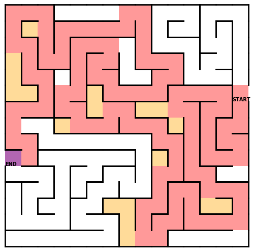

# Maze generator and solver

Python scripts for generating random solvable mazes using the depth-first search and recursive backtracking algorithms. The code also implements a recursive backtracking pathfinding algorithm for solving the generated mazes.


Both the generator and the solver algorithm use recursive backtracking. Here is an example of how that looks like:



 Cells indicated in light orange are part of the backtracking. The algorithm moves randomly from a cell to one of its unvisited neighbors. If the search reaches a cell for which all neighbors are visited, the search backtracks until it moves to a cell with unvisited neighbors.

 The generator algorithm is inspired by the pseudocode provided by [Wikipedia](https://en.wikipedia.org/wiki/Maze_generation_algorithm). The main difference between the generator and solver algorithms is that, when solving the maze, one has to take into account not being able to move through walls, so proper pathfinding needs to be implemented. There is also an enhanced version of the solver algorithm. Instead of jumping to a random neighbor, this version moves to the one that minimizes the L2 distance, sqrt(x^2 + y^2), to the exit cell.

## Quick Use Guide

The first step is to install the dependencies is by opening the terminal, navigating to the MazeGenerator directory, and running

`pip install -e .`

Next, run the `quick_start` python example under the examples directory. If this runs without any errors,
you should be fine to create your program. Use the format outlined in quick_start, or use
another example as a template.

The process for creating and solving a maze follows.

    1. Create a maze manager
    2. Add a maze to the manager
    3. Solve the maze
    4. Optionally visualize the results

An example of using the library with different options is shown below.

```python

from pymaze.maze_manager import MazeManager
from pymaze.maze import Maze


if __name__ == "__main__":

    # The easiest way to use the library is through the Manager class. It acts as the glue between
    # The visualization, solver, and maze classes. Mazes inside the manager have unique ids that we use
    # to specify particular mazes.
    manager = MazeManager()

    # We can add mazes to the manager two different ways.
    # The first way, we specify the maze dimensions. The maze that is created gets returned back to you.
    maze = manager.add_maze(10, 10)

    # The second way is by creating a maze, and then adding it to the manager. Doing this will require you to add
    # from src.maze import Maze
    # to your imports. Because the ids need to be unique, the manager will ensure this happens. It may change the
    # id of the maze that was passed in, so we assign it to the return value to make sure we're using the updated maze.
    maze2 = Maze(10, 10)
    maze2 = manager.add_existing_maze(maze2)

    # Once we have a maze in the manager, we can tell the manager to solve it with a particular algorithm.
    #manager.solve_maze(maze.id, "BreadthFirst")
    #manager.solve_maze(maze.id, "BiDirectional")
    manager.solve_maze(maze.id, "DepthFirstBacktracker")

    # If we want to save the maze & maze solution images along with their animations, we need to let the manager know.
    manager.set_filename("myFileName")

    # To see the unsolved maze, call
    manager.show_maze(maze.id)

    # You can also set the size of the cell by passing show_maze's second argument. The default is 1.
    # manager.show_maze(maze.id, 2)

    # To show an animation of how the maze was generated, use the following line
    manager.show_generation_animation(maze.id)

    # You can also see an animation of how the solver went about finding the end
    manager.show_solution_animation(maze.id)

    # Finally, you can show an image of the maze with the solution path overlaid. All of these display
    # functions will save the figure if MazeManager::set_filename has been set.
    manager.show_solution(maze.id)
```

## Developer's Guide

### Source Layout

* /pymaze/   Holds the source code (modules) needed to run MazeGenerator.
* /tests/ Holds the unit tests that test the code in /src/
* /examples/ Example files that demonstrate how to use the library.

### Class Overview

* The`Maze` class. This class provides helper functions to easily manipulate the cells. It can be thought of as being a grid of Cells
* The `Cell` class is used to keep track of walls, and is what makes up the list.
* The `Visualizer` class is responsible for handling the generation, display, and saving of animations and grid images. It can be interacted with directly, or controlled thought the `MazeManager` class.
* The `Solve` class. All solution methods are derived from this class.
* The `MazeManager` class acts as the glue, bridging the `Visualizer`, `Maze`, and `Solve` classes together.

### Adding a new Solution Algorithm

#### Additional Overhead

Be sure to add it to add the method to `quick_start.py`. Also create a new example file using the method.

### Adding a new Maze Generation Algorithm

#### Additional Overhead

Be sure to create a new example using the new generation algorithm.

#### Using the linter

The style guide employed is pycodestyle. To install pycodestyle, navigate to the main directory and run

`pip install -r requirements.txt`

To check your file run

`pycodestyle pymaze/my_file.py`.
