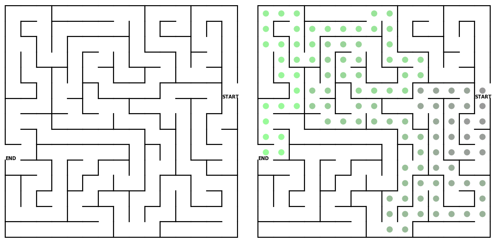

# MazeGenerator
Python scripts for generating random solvable mazes using the depth-first search and recursive backtracking algorithms. The code also implements a recursive backtracking pathfinding algorithm for solving the generated mazes.

